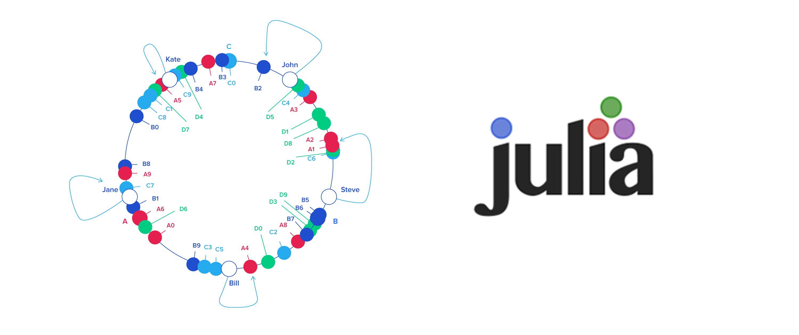
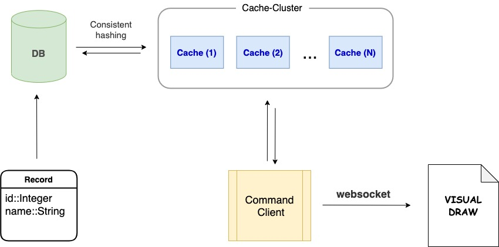

# Interactive Consistent Hashing
<p align="center">
  
</p>

## Introduction
Consistent Hashing is a popular technique used in distributed system and has been detailed and explained in many software-engineering writings, yet there seems to be far fewer implementation examples, let alone interactive ones regarding this concept. Since I currently wanted to try out Julia, I decided to take this matter into my own hand by simulating how a distributed system that applies consistent-hashing works. The idea would be having an interactive app that shows how consistent-hashing works - `visually`.

To have such app that correctly behaves like a distributed architecture, it would lovely to have multiple components that bind together, namely:

- a Persistent Storage, eg Database
- N cache servers to form a cluster
- a query-command client
- regarding visual part - a plotting or drawing component

Modelling a persistent storage - or a database - is simple: just use some DataFrame-like library. I looked around and found `TypedTables`: simple and intuitive apis, good documents. This was certainly the easiest part of the job.

Developing a mock cache-cluster required more manual labors, but also easy. Caching is all about performing key-value look-ups. Few lines of code with the basic `Dict` and `List` would do it. Only a few notable things are:
- Virtual-server-nodes can be distributed either evenly or randomly over the hashing-ring - depending on however we want it. For the sake of visual-clarity, even-distribution is the default fashion.
- The hashing function written [here](https://github.com/vutran1710/interactive-consistent-hashing/blob/master/system/src/cache.jl#L53) is quite impractical, since the database is storing record with monotonic, incremental primary keys. In practice, when dealing with monotonic keys, a variation of consistent-hashing is [considered](https://en.wikipedia.org/wiki/Hash_table#Monotonic_keys). For non-number keys, a different hashing function should be used.

A query-command client is needed to interact with the system. It should be able perform storage operations like querying, adding and removing data. To see how consistent-hashing works, a command client should aslo be able to turn off - or failing -servers in cache-cluster. A CLI app would be more than enough to accomplish this task.

While modeling the first 3 components is simple, the visual component is actually a little more complicated. Ideally a plot library written in Julia would be best, yet the compiling and start-up times of libs like gadfly / Juliaplots  make developing with them plainly horrible - especially for a project that requires continuous testing and developing. After many failed attempt, I decided to switch back to Javascript. Well, hand-drawing stuffs is not exactly enjoyable, but not much of a pain in the ass either. The problem is, there must be away for this Javascript app to receive data from the command-client app. Spawning a websocket server is the answer then.


## Modelling Architecture
<p align="center" style="margin:20px auto;">
  
</p>


## Running
#### Option 1: the no-brainer way
Pull from docker hub and run it
```shell
$ docker run -ti -p 4444:4444 -p 8081:8081 vutrio/interactive_consistent_hashing
```
Wait until the pulling and initial setup finished, showing something like this...
```shell
[ ok ] Starting web server: lighttpd.
-------------------- INTERACTIVE-CONSISTENT-HASHING ----------------------
Made by VuTran
@github: vutran1710
@email: me@vutr.io

Initializing a sample app
- 1000 records, 3 cache-servers & 4 virtual node each servers
Initializing WS server, binding 0.0.0.0:8081
...
command /
```
Open http://localhost:4444 to see shit!


#### Option 2: building the App manually with Docker
You can build and run the app with Docker by following:

Clone the app
```shell
$ git clone https://github.com/vutran1710/interactive-consistent-hashing
$ cd <project-dir>
```

Build the App with docker, tag the image with some name, eg: `ich` (which stands for *Iteractive-Consistent-Hashing*)
```shell
$ docker build -t ich .
```

Run the App, exposing the websocket port and web-app server's port
```shell
$ docker run -ti -p 4444:4444 -p 8081:8081 ich:latest
```

A sample modelling app will be initialized with 1000 records, 3 cache servers and 4 virtual nodes each servers. After initialization finished, open http://localhost:4444.


#### Option 3: running in development-mode with Julia & NodeJS
- Installing dependencies
```shell
$ julia --project=.
# in julia interactive env
pkg> dev --local
```

- Running the backend App
```shell
$ julia --project=. src/consistent_hashing.jl
```

- Go to `webapp` dir and do the routine work
```shell
# project dir
$ cd webapp/
$ npm install
$ npm start
```
- Go to http://localhost:4444

### Usage
The backend App provides a simple command-line-interface, and the client, when run with default config, will be available at http://localhost:4444

When the client webapp connects to the backend app over web-socket, every change to the system will be forwarded and drawn in the client.

```shell
~~~~~~~~~~~~~~~~~~~~~~~~~~~~~~~~~~~~~~~~~~~~~~~~~~~~~~~~~~~~~~~~~~~~~~~~~~
/new
	# create/recreate backend-app, with a database and a cache-cluster
	'args:
		- record_number::Integer
		- cache_number::Integer
		- virtual_node_for_each_cache_number::Integer
	'returns:
		# List of node-info, including node-label, angle,
		# server-id and online-status
		- Array{Tuple{String, Float, ServerID, Boolean}}

/get
	# get a single record by record-id
	'args:
		- record_id::Integer
	'returns:
		# Record data if found, and server-id of the cache
		# that is mapped to the hashed record_id
		- Tuple{Union{Record, Nothing}, ServerID}

/add
	# add more records
	'args:
		- record_number::Integer
	'returns:
		# New length of the updated table
		- Integer

/hash
	# find hashing and the mapped server to a given record-id
	'args:
		- id::Integer
	'returns:
		# Return a list of the given-input, the hashed value,
		# and the correspondent server-id
		- Array{id::Integer, hashed::Angle, nearest::Angle, ServerID}

/fail
	# failing a random cache-server from cluster
	'args: none
	'returns:
		# The updated cache cluster info
		- Array{Tuple{String, Float, ServerID, Boolean}}

/help
	# show this diaglog again
============================== !SHOWTIME! ================================
command /
```
